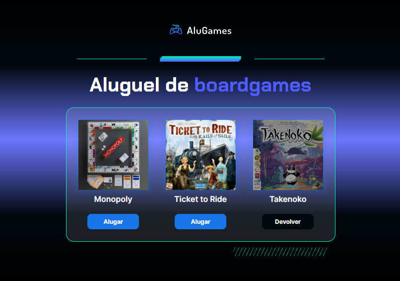

  

## 🚀 Tecnologias

Esse projeto foi desenvolvido com as seguintes tecnologias:

- HTML
- CSS
- JavaScript

## 💻 Projeto

Controle de Status de Jogos
Bem-vindo ao Controle de Status de Jogos! Este projeto é uma ferramenta que ajuda você a gerenciar os jogos que alugou.

O Que Este Projeto Faz?
Imagine que você tem uma coleção de jogos e quer manter o controle de quais estão alugados e quais estão disponíveis. Este projeto facilita isso!

Status de Aluguel: Você pode clicar em um jogo para alternar entre "Alugado" e "Disponível".
Mensagem de Confirmação: Se você clicar em um jogo alugado por engano, ele pergunta se você realmente quer devolvê-lo.
Como Usar
Clique no Jogo: Basta clicar no jogo que você quer alugar ou devolver.
Confirme (se necessário): Se você clicar em um jogo alugado, ele pedirá para confirmar antes de devolvê-lo.
Veja as Alterações: Observe como o jogo muda na tela para refletir o status atual.
Este projeto é útil para quem gosta de manter um registro organizado de seus jogos alugados. É fácil de usar e pode ajudá-lo a evitar confusões sobre quais jogos você tem em casa ou na loja.

